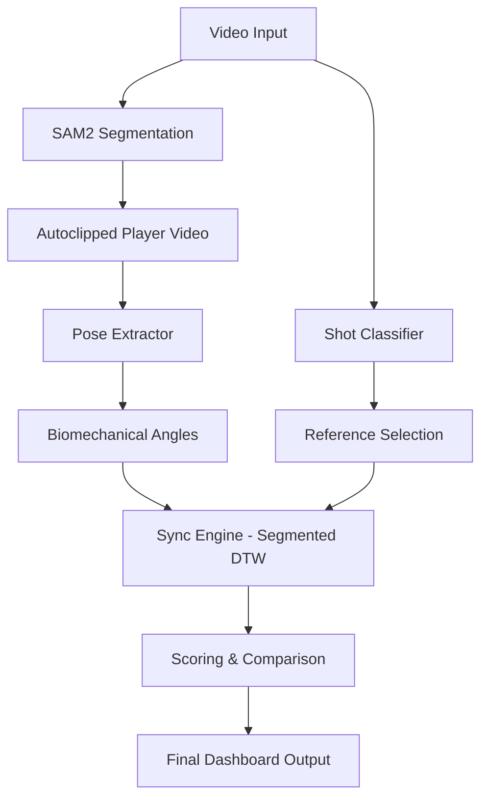
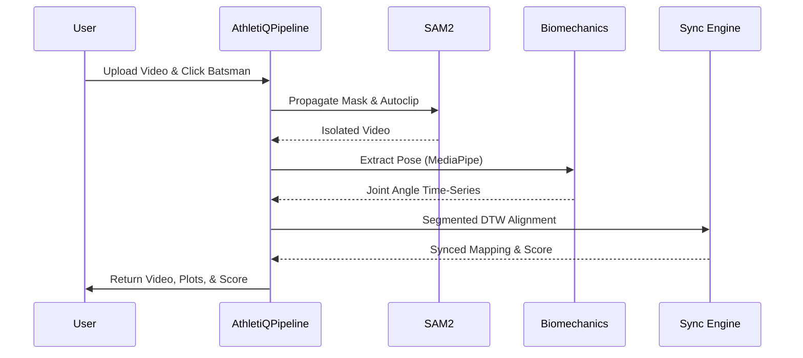

# 🏏 AthletiQ: Unified Biomechanical Performance Pipeline

AthletiQ is a state-of-the-art performance analysis platform designed to provide elite-level biomechanical feedback for cricket players. By leveraging cutting-edge computer vision, temporal alignment algorithms, and automated phase detection, AthletiQ transforms standard practice videos into detailed technical reports.

---

## 🌟 Key Features

- **Automatic Shot Classification**: Utilizes a deep 3D Convolutional Neural Network (R3D-18) to automatically identify 10+ types of cricket shots.
- **AI-Powered Player Segmentation**: Integrates **Meta's SAM2** to isolate the batsman, removing background interference.
- **Automatic Motion Clipping (Autoclipping)**: Automatically trims video to the active motion range based on real-time tracking data, ensuring analysis focuses only on the shot.
- **Segmented DTW Alignment**: An advanced version of Dynamic Time Warping that aligns videos in two distinct phases (Start-to-Strike and Strike-to-End) for pinpoint accuracy.
- **Performance Pipeline Trigger**: A unified API-ready class that can be integrated into FastAPI, Flask, or Node.js backends.
- **Full-Body Biometrics**: Now tracks **Hip, Elbow, Knee, and Shoulder** angles for comprehensive postural analysis.
- **Interactive Plotly Trends**: Real-time interactive charts showing your technique vs. professional IQR corridors across the entire shot.
- **Automatic Shot Classification**: Utilizes a deep 3D Convolutional Neural Network (R3D-18) to identify 10+ shot types.
- **AI-Powered Player Segmentation**: Integrates **Meta's SAM2** to isolate the batsman.
- **Segmented DTW Alignment**: Aligns videos across critical phases (Backlift to Strike, Strike to Follow-through).
- **Objective Technical Scoring**: Evaluates performance by comparing joint angles against professional **Interquartile Range (IQR)** statistics.
- **Side-by-Side Visualization**: Generates slow-motion, frame-synced comparison videos with phase-aligned rendering.

---

## 🏗️ System Architecture

AthletiQ uses a **Service-Oriented Architecture** designed for seamless integration into web backends. The core logic is decoupled from the UI, allowing the analysis to be triggered by any interface.

### Project Structure
- **`app/main.py`**: The entry point for the application.
- **`app/core/pipeline.py`**: The **Master Trigger** class (`AthletiQPipeline`) that orchestrates the full AI analysis.
- **`app/services/`**: Specialized engines for AI model management, video transcoding, and biomechanical analysis.
- **`app/ui/`**: Modularized Gradio interface components.



---

## 🔄 Processing Flow



---

## 🚀 Getting Started

### Installation
1. Clone the repository and install dependencies:
   ```bash
   git clone <repository-url>
   cd AthletiQ
   pip install -r requirements.txt
   ```

### Running the Application
```bash
python app/main.py
```

### Backend Integration Example
To trigger the analysis from a custom backend:
```python
from app.core.pipeline import pipeline

results = pipeline.process(
    video_path="practice.mp4", 
    click_coords=(320, 240), 
    shot_type="Cover Drive"
)
```

---

## 📜 Technical Breakdown

### 1. Model Lifecycle Management (`app/services/ai_models.py`)
Manages SAM2, ShotClassifier, and PoseExtractor as singletons to ensure memory efficiency and prevent redundant model loading.

### 2. Sync Engine: Segmented DTW (`core/syncing/sync_engine.py`)
- **Phase Detection**: Detects the "Strike" moment via wrist trajectory.
- **Piecewise Alignment**: Performs separate DTW alignments for distinct shot phases to ensure high-fidelity synchronization.

---

## 📜 License
MIT License.

---
*Developed by AthletiQ Team - Precision Biomechanics for the Modern Game.*
