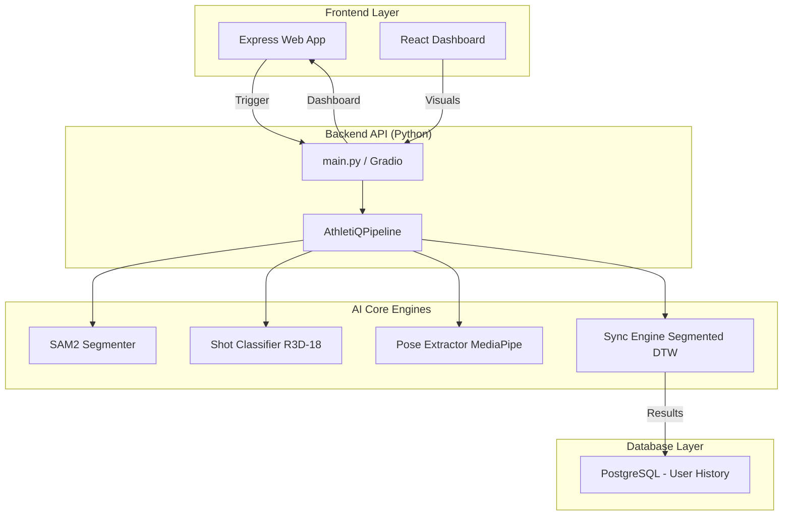
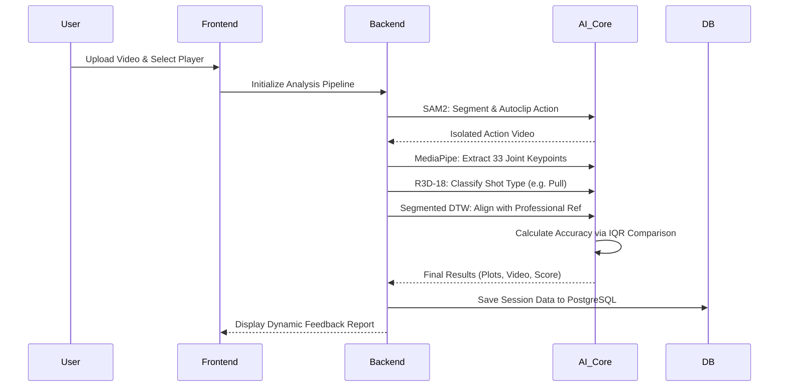

# 🏏 AthletiQ: Unified Biomechanical Performance Pipeline

AthletiQ is a state-of-the-art performance analysis platform designed to provide elite-level biomechanical feedback for cricket players. By leveraging cutting-edge computer vision, temporal alignment algorithms, and automated phase detection, AthletiQ transforms standard practice videos into detailed technical reports.

---

## 🌟 Key Features

### 🧠 AI-Driven Analysis
- **Automatic Shot Classification**: Utilizes a deep 3D Convolutional Neural Network (R3D-18) to automatically identify 10+ types of cricket shots.
- **AI-Powered Player Segmentation**: Integrates **Meta's SAM2** to isolate the batsman, removing background interference.
- **Automatic Motion Clipping (Autoclipping)**: Automatically trims video to the active motion range based on real-time tracking data.
- **Segmented DTW Alignment**: An advanced version of Dynamic Time Warping that aligns videos in two distinct phases (Start-to-Strike and Strike-to-End).
- **Full-Body Biometrics**: Tracks **Hip, Elbow, Knee, and Shoulder** angles for comprehensive postural analysis.

### 💻 Unified Web Ecosystem
- **Dual-Frontend Architecture**: 
  - **Classic Web**: Express.js server with a futuristic HTML/CSS/JS interface.
  - **Modern Dashboard**: High-performance React + Vite interface with fluid animations.
- **Persistent User Analytics**: Integrated **PostgreSQL (Neon)** for secure user authentication and historical performance tracking.
- **Interactive Plotly Trends**: Real-time interactive charts showing your technique vs. professional IQR corridors.
- **Objective Technical Scoring**: Evaluates performance by comparing joint angles against professional **Interquartile Range (IQR)** statistics using weighted joint analysis.

---

## 🏗️ System Architecture

AthletiQ uses a **Service-Oriented Architecture** designed for seamless integration. The core logic is decoupled from the UI, allowing the analysis to be triggered by web, mobile, or desktop interfaces.

### Project Structure
- **`app/main.py`**: Entry point for the Gradio-based analysis dashboard.
- **`frontend/`**: Express.js backend and classic web interface.
- **`frontend-react/`**: Modern React-based performance dashboard.
- **`app/core/pipeline.py`**: The **Master Trigger** class (`AthletiQPipeline`) that orchestrates the full AI analysis.
- **`app/services/`**: 
  - `ai_models.py`: Singleton management for SAM2, R3D-18, and MediaPipe.
  - `analysis_engine.py`: Core scoring, DTW alignment, and plot generation logic.
  - `video_engine.py`: Transcoding and frame processing utilities.
- **`core/`**: Low-level biomechanical logic and synchronization algorithms.
- **`assets/references/`**: Curated library of professional cricket shot references and statistical profiles.



---

## 🔄 Processing Flow

The following sequence outlines how AthletiQ processes a single practice video from upload to technical report generation.



---

## 🚀 Getting Started

### Installation
1. Clone the repository and install dependencies:
   ```bash
   git clone <repository-url>
   cd AthletiQ
   pip install -r requirements.txt
   ```
2. Set up the frontend:
   ```bash
   cd frontend
   npm install
   ```

### Running the Application
1. **Launch the Web Interface (Express)**:
   ```bash
   cd frontend
   node server.js
   ```
2. **Launch the Analysis Dashboard (Gradio)**:
   ```bash
   python app/main.py
   ```

---

## 🛠️ Maintenance & Utilities

AthletiQ includes several utility scripts for managing the reference library:
- **`app/scripts/clean_references.py`**: Scans the reference library and removes unused files to optimize storage.
- **`generate_shot_references.py`**: Automates the creation of new reference profiles from raw professional footage.
- **`convert_references.py`**: Ensures all video references are in the optimal format for cross-browser playback.

---

## 📜 License
MIT License.

---
*Developed by AthletiQ Team - Precision Biomechanics for the Modern Game.*
