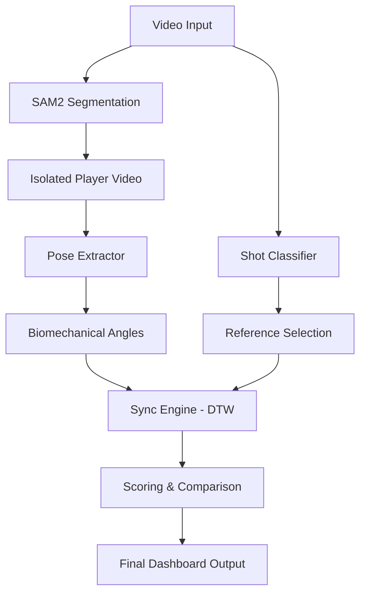
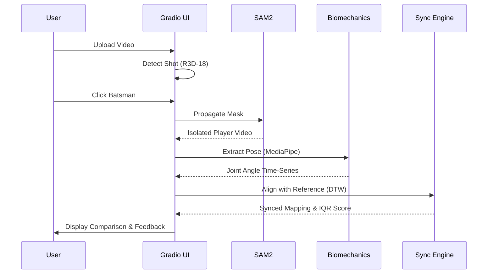

# 🏏 AthletiQ: Unified Biomechanical Performance Pipeline

AthletiQ is a state-of-the-art performance analysis platform designed to provide elite-level biomechanical feedback for cricket players. By leveraging cutting-edge computer vision and temporal alignment algorithms, AthletiQ transforms standard practice videos into detailed technical reports, comparing player movements against professional reference standards.

---

## 🌟 Key Features

- **Automatic Shot Classification**: Utilizes a deep 3D Convolutional Neural Network (R3D-18) to automatically identify 10+ types of cricket shots (Cover Drive, Sweep, Hook, etc.).
- **AI-Powered Player Segmentation**: Integrates **Meta's SAM2 (Segment Anything Model 2)** to isolate the batsman from complex backgrounds, ensuring high-fidelity analysis even in noisy environments.
- **High-Fidelity Pose Extraction**: Uses **MediaPipe Pose** with custom interpolation logic to track 33 joint landmarks and calculate critical biomechanical angles.
- **Temporal Synchronization (DTW)**: Employs **Dynamic Time Warping** to align a practice video with professional reference shots, accounting for differences in speed and timing.
- **Objective Technical Scoring**: Evaluates performance by comparing joint angles against professional **Interquartile Range (IQR)** statistics, providing an objective "Technical Score."
- **Side-by-Side Visualization**: Generates slow-motion, frame-synced comparison videos for visual technical audits.

---

## 🏗️ System Architecture

The AthletiQ pipeline is built on a modular architecture that separates data acquisition, core processing, and interactive visualization.



---

## 🔄 Processing Flow

AthletiQ follows a rigorous sequence to ensure accuracy from pixel to performance metric.



---

## 🛠️ Technical Deep-Dive

### 1. Shot Classification (`core/shot_classifier.py`)
The system identifies the shot type using a specialized R3D-18 model. This allows the pipeline to automatically pull the correct professional reference dataset (angles and video) for the specific movement being analyzed.

### 2. Player Segmentation (`segment-anything-2`)
Standard pose detection often struggles with busy cricket backgrounds (nets, fielders, equipment). AthletiQ uses SAM2 to isolate the player, creating a "clean" input stream for the biomechanical engine, which significantly improves landmark accuracy.

### 3. Biomechanics & Pose Extraction (`core/biomechanics/`)
- **PoseExtractor**: Wraps MediaPipe with a robust interpolation layer to fill temporal gaps in detection.
- **Angle Calculation**: Computes relative angles for elbows, shoulders, hips, and knees—the fundamental building blocks of cricket mechanics.

### 4. Sync Engine (`core/syncing/sync_engine.py`)
Cricket shots happen at different speeds. The Sync Engine uses **Dynamic Time Warping (DTW)** to find the "optimal path" between practice and reference frames. This ensures that the comparison is technically valid regardless of the player's tempo.

---

## 🚀 Getting Started

### Prerequisites
- Python 3.10+
- NVIDIA GPU with CUDA (Highly Recommended for SAM2)
- ffmpeg

### Installation
1. Clone the repository:
   ```bash
   git clone <repository-url>
   cd AthletiQ
   ```

2. Install dependencies:
   ```bash
   pip install -r requirements.txt
   ```

3. Download Model Weights:
   - SAM2 weights should be placed in `models/sam2/checkpoints/`
   - Shot detection model in `models/shot_detection/`

### Running the Dashboard
Start the unified performance pipeline:
```bash
python app/main_dashboard.py
```
Access the UI via the local URL (typically `http://127.0.0.1:7860`).

---

## 📊 Output & Analytics

AthletiQ provides multi-dimensional feedback:
- **Technical Score (%)**: A weighted score based on how many frames fall within the professional IQR (Interquartile Range).
- **Segmented Video**: An isolated MP4 of the player, useful for focusing on body shape.
- **Comparison Video**: A side-by-side, synced MP4 for visual analysis.
- **Biomechanics JSON**: Raw angle data for further statistical research or integration into third-party apps.

---

## 📜 License
This project is licensed under the MIT License - see the LICENSE file for details.

---
*Developed by AthletiQ Team - Precision Biomechanics for the Modern Game.*
