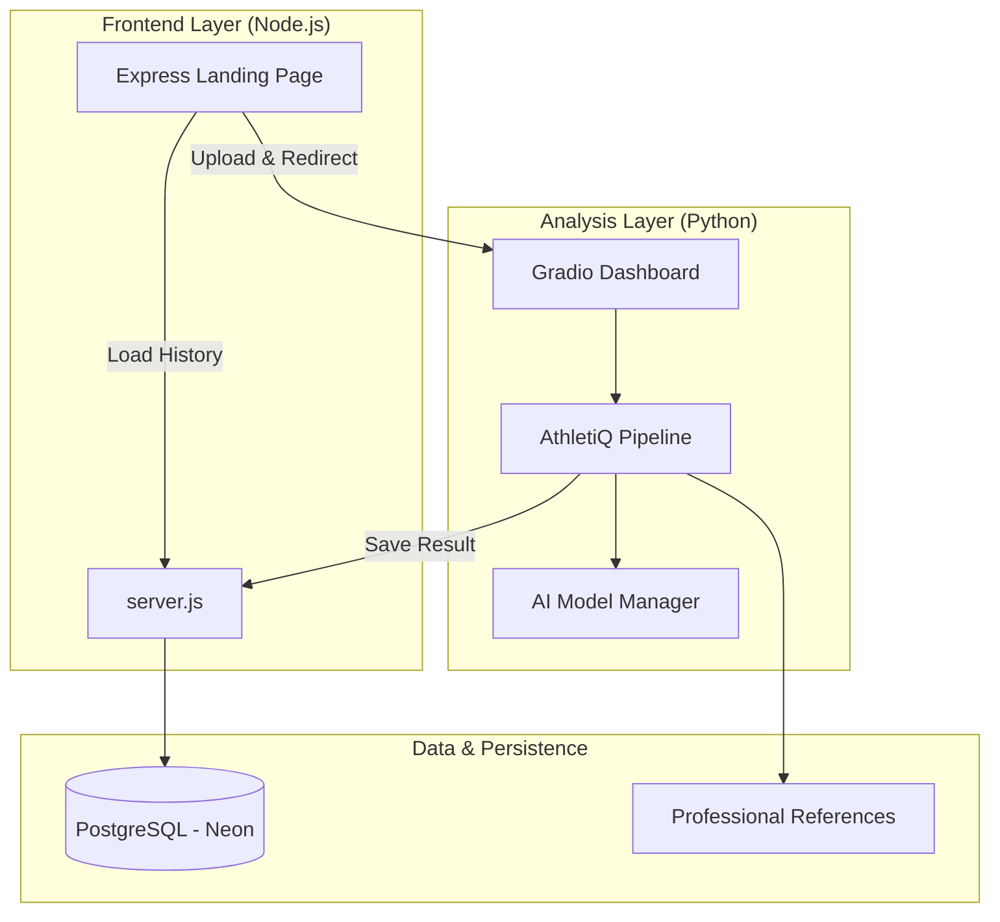
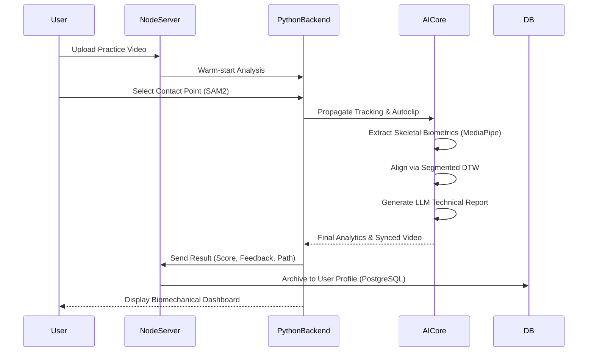

# 🏏 AthletiQ: AI-Powered Biomechanical Analysis Pipeline


AthletiQ is a state-of-the-art performance analysis platform designed to provide elite-level biomechanical feedback for cricket players. By leveraging computer vision, temporal alignment, and generative AI feedback, AthletiQ transforms standard practice videos into detailed technical diagnostics.

---

## 🌟 Core Technologies

### 🧠 Computer Vision & AI
- **Meta SAM2**: Real-time player segmentation and background isolation.
- **MediaPipe Pose**: High-fidelity 3D skeletal tracking (33 keypoints).
- **R3D-18 CNN**: Automatic shot classification (Cover Drive, Pull, Sweep, etc.).
- **Segmented DTW**: Specialized Dynamic Time Warping for phase-accurate temporal alignment.
- **Generative AI Feedback**: Automated LLM-based technical reporting and corrective coaching tips.

### 💻 System Stack
- **Frontend**: Futuristic Vanilla HTML/JS interface with CSS-Glassmorphism.
- **Server**: Node.js (Express) with robust session and database management.
- **Dashboard**: Python (Gradio) for high-performance biomechanical visualization.
- **Persistence**: PostgreSQL (Neon Cloud) for historical performance tracking and profile management.

---

## 🏗️ System Architecture

AthletiQ uses a **Service-Oriented Architecture** where the Node.js frontend orchestrates user sessions while the Python backend handles heavy-duty AI processing.

### Project Structure
- **`app/main.py`**: Entry point for the Gradio-based analysis dashboard.
- **`app/core/pipeline.py`**: The **Master Trigger** class (`AthletiQPipeline`) orchestrating the AI stack.
- **`app/services/`**: 
  - `ai_models.py`: Singleton management for SAM2, R3D-18, and MediaPipe.
  - `video_engine.py`: Optimized transcoding and frame extraction with caching.
  - `llm_engine.py`: Generative feedback engine for technical reports.
- **`core/`**: Core biomechanical logic and shot synchronization algorithms.
- **`frontend/`**: Node.js Express server and main landing page.
- **`assets/references/`**: Curated library of 10+ professional shot profiles and IQR statistics.
- **`models/`**: Centralized storage for AI model binaries (SAM2 checkpoints, MediaPipe tasks).



---

## 🔄 Processing Workflow

The following sequence outlines the high-speed data flow from video upload to technical report generation.



---

## 🚀 Installation & Setup

### 1. Backend Setup (Python)
Ensure you have Python 3.10+ and a CUDA-compatible GPU (recommended) or CPU.
```bash
# Clone the repository
git clone https://github.com/milansinghal2004/AthletiQ.git
cd AthletiQ

# Install Python dependencies
pip install -r requirements.txt

# SAM2 Installation (Included in repo)
cd segment-anything-2
pip install -e .
cd ..
```

### 2. Frontend Setup (Node.js)
```bash
cd frontend
npm install
```

### 3. Database Configuration
Create a `.env` file in the `frontend` folder or set the environment variable:
```env
DATABASE_URL=your_postgresql_connection_string
```

---

## 🛠️ Usage Guide

### Running Locally

1. **Start the Frontend Server**:
   ```bash
   cd frontend
   npm start
   ```
   *Access at: `http://localhost:3000`*

2. **Start the Analysis Engine**:
   ```bash
   # In a new terminal (from project root)
   python app/main.py
   ```
   *The dashboard will auto-integrate with the frontend.*

### Analysis Steps
1. **Login/Register** to track your progress.
2. **Upload** your cricket shot video.
3. **Click** the ball-contact point in the first frame.
4. **Select** the shot type (or let AI auto-detect).
5. **Analyze** and view your biomechanical score vs. professionals.

---

## 🏷️ GitHub Tags & Keywords
`biomechanics` `cricket-analytics` `computer-vision` `SAM2` `pose-estimation` `mediapipe` `dynamic-time-warping` `express-js` `gradio` `sports-tech` `AI-coaching`

---
*Developed with ❤️ by the AthletiQ Team - Precision Biomechanics for the Modern Game.*
