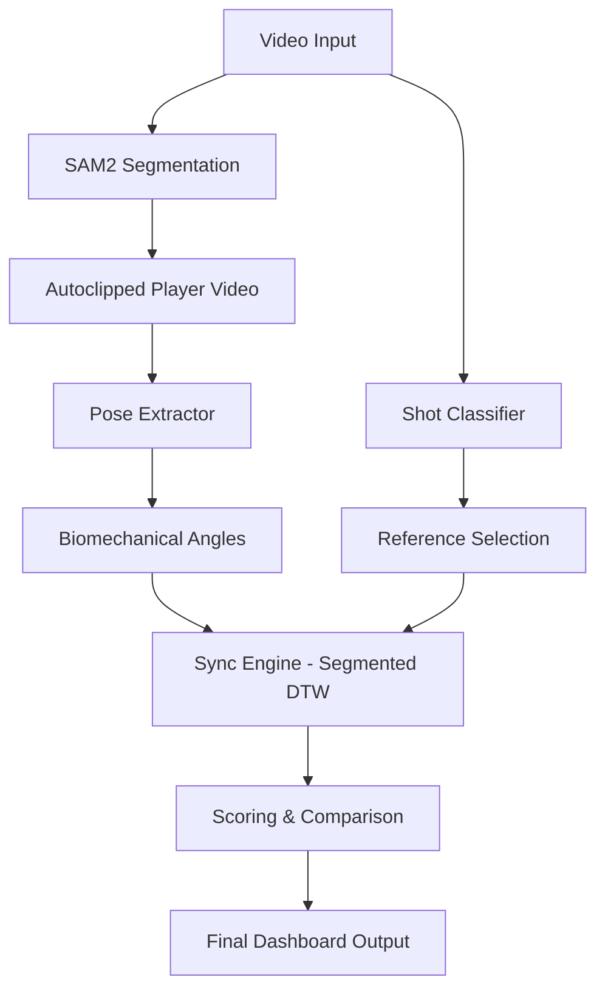
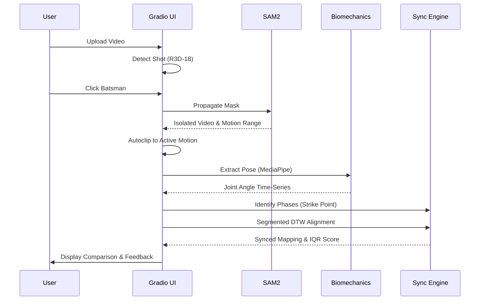

# 🏏 AthletiQ: Unified Biomechanical Performance Pipeline

AthletiQ is a state-of-the-art performance analysis platform designed to provide elite-level biomechanical feedback for cricket players. By leveraging cutting-edge computer vision, temporal alignment algorithms, and automated phase detection, AthletiQ transforms standard practice videos into detailed technical reports.

---

## 🌟 Key Features

- **Automatic Shot Classification**: Utilizes a deep 3D Convolutional Neural Network (R3D-18) to automatically identify 10+ types of cricket shots.
- **AI-Powered Player Segmentation**: Integrates **Meta's SAM2** to isolate the batsman, removing background interference.
- **Automatic Motion Clipping (Autoclipping)**: Automatically trims video to the active motion range based on real-time tracking data, ensuring analysis focuses only on the shot.
- **Segmented DTW Alignment**: An advanced version of Dynamic Time Warping that aligns videos in two distinct phases (Start-to-Strike and Strike-to-End) for pinpoint accuracy.
- **Strike Detection & Phase Analysis**: Automatically identifies the "Strike" (impact) moment by analyzing wrist trajectories and vertical displacement.
- **Objective Technical Scoring**: Evaluates performance by comparing joint angles against professional **Interquartile Range (IQR)** statistics.
- **Side-by-Side Visualization**: Generates slow-motion, frame-synced comparison videos with phase-aligned rendering.

---

## 🏗️ System Architecture

The AthletiQ pipeline is built on a modular architecture that separates data acquisition, core processing, and interactive visualization.



---

## 🔄 Processing Flow

AthletiQ follows a rigorous sequence to ensure accuracy from pixel to performance metric.



---

## 🛠️ Technical Deep-Dive

### 1. Shot Classification (`core/shot_classifier.py`)
Identifies the shot type using a specialized R3D-18 model, automatically pulling the correct professional reference dataset.

### 2. Player Segmentation & Autoclipping (`segment-anything-2`)
Uses SAM2 to isolate the player. The system now includes **Autoclipping logic** that identifies the exact frames where the batsman is active, trimming the video to remove irrelevant pre-shot and post-shot footage.

### 3. Biomechanics & Pose Extraction (`core/biomechanics/`)
Extracts 33 joint landmarks and calculates relative angles for critical joints (elbows, shoulders, hips, knees). Includes a robust interpolation layer for consistent tracking.

### 4. Sync Engine: Segmented DTW (`core/syncing/sync_engine.py`)
A major upgrade from global alignment. The engine now:
- **Identifies Phases**: Detects the "Strike" moment by analyzing the vertical Y-coordinate of the wrists.
- **Segmented Alignment**: Performs separate DTW alignments for the backlift (Start-to-Strike) and the follow-through (Strike-to-End). This prevents temporal drift and ensures that the most critical moment of the shot is perfectly aligned.

---

## 🚀 Getting Started

### Prerequisites
- Python 3.10+
- NVIDIA GPU with CUDA (Highly Recommended for SAM2)
- ffmpeg

### Installation
1. Clone the repository and install dependencies:
   ```bash
   git clone <repository-url>
   cd AthletiQ
   pip install -r requirements.txt
   ```

2. Download Model Weights to the `models/` directory.

### Running the Dashboard
```bash
python app/main_dashboard.py
```

---

## 📊 Output & Analytics

- **Technical Score (%)**: Weighted score based on professional IQR alignment.
- **Autoclipped Segmented Video**: Trimmmed, isolated video of the player.
- **Comparison Video**: Phase-synced, side-by-side slow-motion video.
- **Biomechanics JSON**: Raw joint angle time-series data.
- **Sync Metadata (`sync_metadata.json`)**: Detailed breakdown of detected phases (start, strike, end) for both practice and reference.

---

## 📜 License
MIT License.

---
*Developed by AthletiQ Team - Precision Biomechanics for the Modern Game.*
