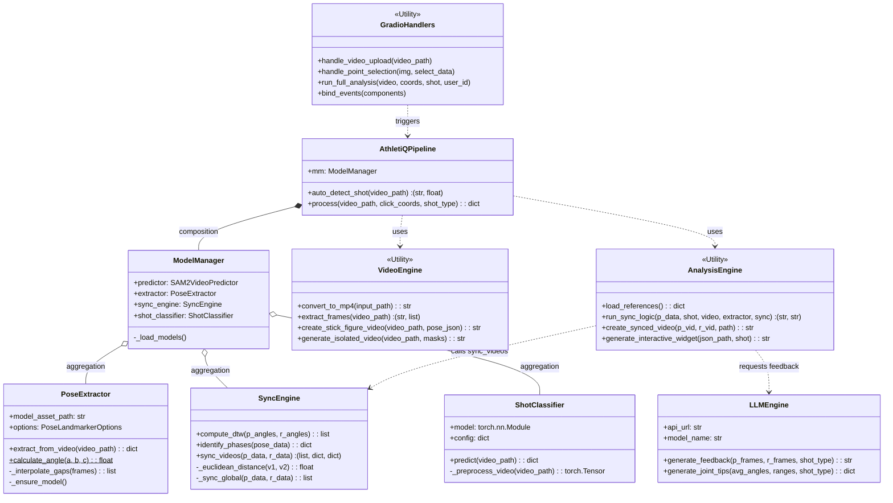

# AthletiQ Detailed Class Diagram

This document provides a comprehensive map of the class structures and functional relationships within the AthletiQ analysis engine.

## Key Architectural Relationships

1.  **Orchestration (Controller)**: `AthletiQPipeline` acts as the Facade for the entire analysis process. It manages the session flow and coordinates between vision tracking and biomechanical analysis.
2.  **Resource Management (Singleton)**: `ModelManager` ensures that heavy AI models (SAM2, MediaPipe) are loaded into memory exactly once and are accessible across different pipeline steps.
3.  **Specialized Logic (Stateless Engines)**: `PoseExtractor` and `SyncEngine` are designed as pure functional engines that process data vectors without maintaining internal session state, making them robust and testable.
4.  **UI Bridge**: `GradioHandlers` translates high-level UI events (clicks, uploads) into pipeline calls, acting as the glue between the Gradio interface and the backend processing.
