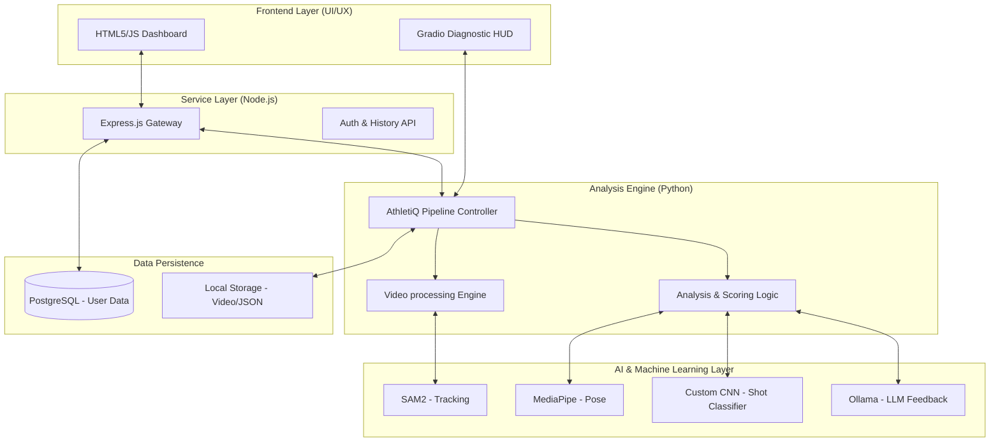
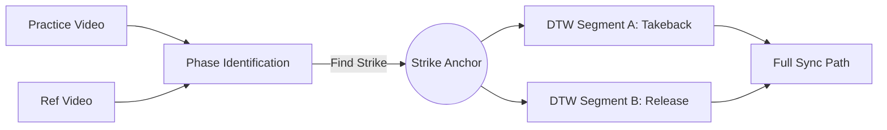

# AthletiQ System Analysis & Architecture

This document provides a technical overview of the AthletiQ biomechanical analysis platform, including architecture diagrams, class structures, and data flow charts.

---

## 1. System Architecture Diagram
The architecture follows a modular, decoupled design with a Node.js gateway and a specialized Python AI engine.



---

## 2. Core Class Diagram
The system is built around a centralized model manager and a high-level pipeline orchestrator.

```mermaid
classDiagram
    class ModelManager {
        +predictor: SAM2Predictor
        +extractor: PoseExtractor
        +sync_engine: SyncEngine
        +shot_classifier: ShotClassifier
        -_load_models()
    }

    class AthletiQPipeline {
        +mm: ModelManager
        +process(video_path, click_coords)
        +auto_detect_shot(video_path)
    }

    class PoseExtractor {
        +options: PoseLandmarkerOptions
        +extract_from_video(video_path)
        +calculate_angle(a, b, c)
        -_interpolate_gaps(frames)
    }

    class SyncEngine {
        +compute_dtw(p_angles, r_angles)
        +identify_phases(pose_data)
        +sync_videos(practice, reference)
    }

    class ShotClassifier {
        +model: torch.nn.Module
        +predict(video_path)
    }

    class LLMEngine {
        +generate_feedback(practice, stats)
        +generate_joint_tips(avg_angles)
    }

    AthletiQPipeline *-- ModelManager
    ModelManager o-- PoseExtractor
    ModelManager o-- SyncEngine
    ModelManager o-- ShotClassifier
    AthletiQPipeline ..> LLMEngine : uses

> [!TIP]
> For a more exhaustive view of attributes and methods, see the [Dedicated Class Diagram](class_diagram.md).

```

---

## 3. Analysis Pipeline Flowchart
A multi-dimensional mapping of the AthletiQ biomechanical processing engine, showcasing the transition from neural vision to biomechanical intelligence.

```mermaid
graph TD
    %% --- INGESTION STAGE ---
    subgraph IN ["1. Ingestion & Initialization"]
        A([User Video Upload]) --> B[FFmpeg: Normalization to MP4]
        B --> C[OpenCV: Frame Extraction]
        B --> D[R3D-18: Automatic Shot Detection]
    end

    %% --- VISION STAGE ---
    subgraph VN ["2. Neural Vision Core"]
        direction LR
        E[UI Click Coordinates] --> F[SAM2: State Initialization]
        F --> G[SAM2: Point-to-Mask Propagation]
        G --> H[Isolator: BG Darkening & Neon Glow]
    end

    %% --- BIOMECHANICS STAGE ---
    subgraph BM ["3. Biomechanical Decoding"]
        direction TB
        H --> I[MediaPipe: 12-Point Landmark Detection]
        I --> J[Geometry Engine: 8-Joint Angle Calculation]
        J --> K[Linear Interpolation: Gap Filling & Smoothing]
    end

    %% --- ALIGNMENT STAGE ---
    subgraph SY ["4. Temporal Intelligence"]
        direction LR
        K --> L[Phase ID: Strike Point Detection]
        L --> M[Segmented DTW: Pro-Benchmarking]
        M --> N[Scoring: Weighted Euclidean Deviation]
    end

    %% --- INSIGHT STAGE ---
    subgraph RT ["5. Insights & HUD Rendering"]
        direction TB
        N --> O[Ollama: Gemma-4 Biometric Reasoning]
        O --> P[Interactive SVG Widget Generation]
        P --> Q[Side-by-Side Synced Video Render]
    end

    %% --- EXTERNAL CONNECTIONS ---
    IN --> VN
    VN --> BM
    BM --> SY
    SY --> RT
    RT --> Z[(PostgreSQL: History Archive)]

    %% --- STYLING ---
    style IN fill:#0a1a0a,stroke:#00ff88,stroke-width:2px
    style VN fill:#0a1a1a,stroke:#00e5ff,stroke-width:2px
    style BM fill:#1a0a1a,stroke:#ff00ff,stroke-width:2px
    style SY fill:#1a1a0a,stroke:#ffff00,stroke-width:2px
    style RT fill:#1a1a1a,stroke:#ffffff,stroke-width:2px
```



---

## 4. Specialized Logic: Segmented DTW
The core differentiator of AthletiQ is the **Segmented DTW** which ensures critical frames (like the strike) are perfectly aligned despite temporal variations in user tempo.


